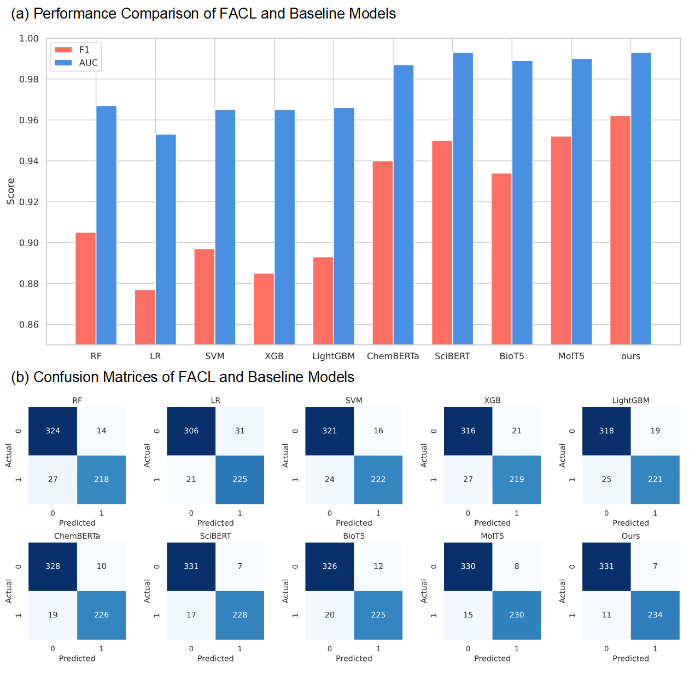
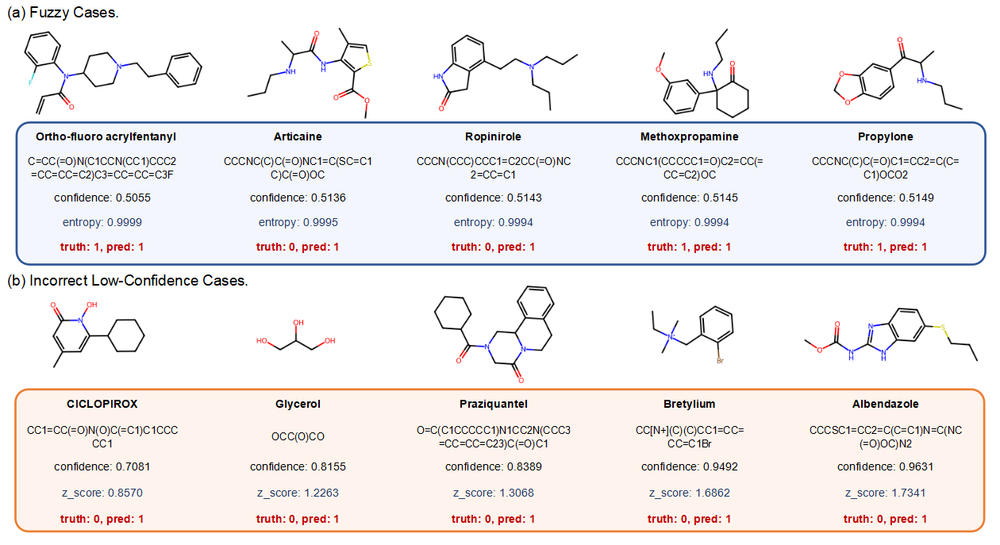

# NPS-FACL: A Fragment-Aware Chemical Language Model with Explainable Uncertainty Quantification

## Overview

The FACL model is a large language model framework designed to classify novel psychoactive substances (NPS) for forensic toxicology applications. It leverages fragment-aware tokenization and explainable uncertainty quantification to enhance NPS detection, offering a valuable tool for rapid substance identification.

## Model Architecture

The FACL model uses an NPS-aware tokenizer to process molecular structures, focusing on key substructures. The overview of the model pipeline is shown below:

**Figure 1**: Overview of the FACL model pipeline, illustrating the NPS detection benchmark and fragment-aware tokenization process.

## Results

FACL outperforms baseline models in NPS classification, as demonstrated by performance comparisons and confusion matrices:

**Figure 2**: (a) Performance comparison of FACL against baseline models; (b) Confusion matrices of FACL and baseline models.

## Dataset

The dataset is available from the author (liupf7@mail2.sysu.edu.cn) upon reasonable request. An example dataset, `data/benchmark.csv`, is provided in the repository for reference.

## Cases Analysis

To understand FACL's classification behavior, we analyzed fuzzy cases and incorrect low-confidence cases:

**Figure 3**: (a) Fuzzy cases with high entropy, reflecting confidence values around 0.5, indicative of classification ambiguity due to structural overlap between NPS and approved drugs; (b) Incorrect low-confidence cases with high confidence but incorrect predictions, where molecules labeled as non-NPS (truth: 0) but predicted as NPS (predicted: 1) may indicate potential NPS risks, warranting further investigation.
